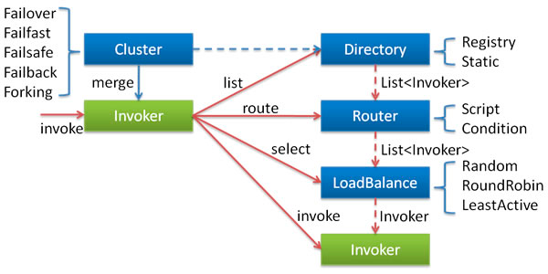

## 项目介绍
dubbo-cluster-fault-tolerance 是 Dubbo的一个高级特性:集群容错,整体项目结构如下:

```text
.
├── README.md
├── dubbo-cft-consumer// 消费者springboot服务
├── dubbo-cft-interface// 公共接口
├── dubbo-cft-provider// 提供者springboot服务
└── pom.xml

```
## 特性说明
在集群调用失败时，Dubbo 提供了多种容错方案，缺省为 failover 重试。


各节点关系：
* 这里的 Invoker 是 Provider 的一个可调用 Service 的抽象，Invoker 封装了 Provider 地址及 Service 接口信息
* Directory 代表多个 Invoker，可以把它看成 List<Invoker> ，但与 List 不同的是，它的值可能是动态变化的，比如注册中心推送变更
* Cluster 将 Directory 中的多个 Invoker 伪装成一个 Invoker，对上层透明，伪装过程包含了容错逻辑，调用失败后，重试另一个
* Router 负责从多个 Invoker 中按路由规则选出子集，比如读写分离，应用隔离等
* LoadBalance 负责从多个 Invoker 中选出具体的一个用于本次调用，选的过程包含了负载均衡算法，调用失败后，需要重选

>1. 通过使用服务注册表和负载平衡，可以提高集群提供的容错能力，服务注册表用于存储有关可用服务及其位置的信息，负载平衡用于确保请求均匀分布在集群中的所有服务器上，如果一台服务器发生故障，负载将转移到其他可用服务器。
>2. 配置监视集群中服务器运行状况的运行状况检查，如果服务器未通过运行状况检查，则可以将其从集群中删除，并将负载转移到其余服务器，确保集群正常运行，并且用户可以使用应用程序。

## 使用场景
多个服务器部署同一集群中，运行同一应用程序，如果一台服务器出现故障，其他服务器将接管负载，确保应用程序对用户仍然可用。

## 部署并测试

### 部署步骤
1. 启动provider-01 (直接通过springboot启动)
2. 启动provider-02
```bash 
# 指定端口和应用名, 避免端口冲突
java -jar dubbo-cft-provider-1.0.0.jar --server.port=8002 --dubbo.application.name=fault-tolerance-provider-02
```
3. 启动consumer (直接通过springboot启动, 首次访问后才会初始化 SpringDispatcherServlet)

### 验证failover模式
访问浏览器 `http://localhost:8003/action/hi?name=lisi&second=3` 观察控制台
* second=3是为了让提供者服务处理超时, 导致远程调用失败, 出发自动重试机制
日志如下:
```text
# 首次访问到了provider-01机器 发生超时,未响应
Hi appName ===> fault-tolerance-provider-01
2023-06-15 12:25:41.053  WARN 41333 --- [:20881-thread-9] o.a.d.rpc.filter.ProfilerServerFilter    :  [DUBBO] [Dubbo-Provider] execute service com.lb.dubbo.service.GreetingService:0.0.0#sayHi cost 3001.737117 ms, this invocation almost (maybe already) timeout. Timeout: 2000ms
client: 172.19.166.180:57926
invocation context:
path=com.lb.dubbo.service.GreetingService;
input=291;
remote.application=fault-tolerance-consumer;
dubbo=2.0.2;
interface=com.lb.dubbo.service.GreetingService;
version=0.0.0;
timeout=2000;
thread info: 
Start time: 130632794428868
+-[ Offset: 0.000000ms; Usage: 3001.737117ms, 100% ] Receive request. Server invoke begin.
  +-[ Offset: 0.090193ms; Usage: 3001.507763ms, 99% ] Receive request. Server biz impl invoke begin.
  
# 通过failover机制触发重试后, 访问到了provider-02 两次  
Hi appName ===> fault-tolerance-provider-02
Hi appName ===> fault-tolerance-provider-02
2023-06-15 12:25:43.089  WARN 41524 --- [20882-thread-12] o.a.d.rpc.filter.ProfilerServerFilter    :  [DUBBO] [Dubbo-Provider] execute service com.lb.dubbo.service.GreetingService:0.0.0#sayHi cost 3001.737911 ms, this invocation almost (maybe already) timeout. Timeout: 2000ms
client: 172.19.166.180:57925
invocation context:
path=com.lb.dubbo.service.GreetingService;
input=291;
remote.application=fault-tolerance-consumer;
dubbo=2.0.2;
interface=com.lb.dubbo.service.GreetingService;
version=0.0.0;
timeout=2000;
thread info: 
Start time: 130634830020135
+-[ Offset: 0.000000ms; Usage: 3001.737911ms, 100% ] Receive request. Server invoke begin.
  +-[ Offset: 0.118811ms; Usage: 3001.467679ms, 99% ] Receive request. Server biz impl invoke begin., dubbo version: 3.2.2, current host: 172.19.166.180, error code: 3-7. This may be caused by , go to https://dubbo.apache.org/faq/3/7 to find instructions. 
2023-06-15 12:25:45.097  WARN 41524 --- [20882-thread-13] o.a.d.rpc.filter.ProfilerServerFilter    :  [DUBBO] [Dubbo-Provider] execute service com.lb.dubbo.service.GreetingService:0.0.0#sayHi cost 3001.717674 ms, this invocation almost (maybe already) timeout. Timeout: 2000ms
client: 172.19.166.180:57925
invocation context:
path=com.lb.dubbo.service.GreetingService;
input=291;
remote.application=fault-tolerance-consumer;
dubbo=2.0.2;
interface=com.lb.dubbo.service.GreetingService;
version=0.0.0;
timeout=2000;
thread info: 
Start time: 130636837999269
+-[ Offset: 0.000000ms; Usage: 3001.717674ms, 100% ] Receive request. Server invoke begin.
  +-[ Offset: 0.108980ms; Usage: 3001.510769ms, 99% ] Receive request. Server biz impl invoke begin., dubbo version: 3.2.2, current host: 172.19.166.180, error code: 3-7. This may be caused by , go to https://dubbo.apache.org/faq/3/7 to find instructions. 

```

### 验证failfast模式

访问浏览器 `http://localhost:8003/action/save?second=3` 观察控制台
* second=3是为了让提供者服务处理超时, 导致远程调用失败, 出发自动重试机制
  日志如下:
```text
# 首次访问到了provider-01机器 发生超时,直接失败
Save appName ===> fault-tolerance-provider-01 time ===>2023/06/15 12:54:44:219
2023-06-15 12:54:47.225  WARN 42115 --- [:20881-thread-4] o.a.d.rpc.filter.ProfilerServerFilter    :  [DUBBO] [Dubbo-Provider] execute service com.lb.dubbo.service.OrderService:0.0.0#save cost 3005.235640 ms, this invocation almost (maybe already) timeout. Timeout: 1000ms
client: 172.19.166.180:58537
invocation context:
path=com.lb.dubbo.service.OrderService;
input=254;
remote.application=fault-tolerance-consumer;
dubbo=2.0.2;
interface=com.lb.dubbo.service.OrderService;
version=0.0.0;
timeout=1000;
thread info: 
Start time: 132378967375690
+-[ Offset: 0.000000ms; Usage: 3005.235640ms, 100% ] Receive request. Server invoke begin.
  +-[ Offset: 0.749604ms; Usage: 3004.342452ms, 99% ] Receive request. Server biz impl invoke begin.
  
# 消费端应用直接返回报错
2023-06-15 12:54:45.253  WARN 42260 --- [nio-8003-exec-1] o.a.d.r.proxy.InvokerInvocationHandler   :  [DUBBO] [Dubbo-Consumer] execute service com.lb.dubbo.service.OrderService#save cost 1045.969811 ms, this invocation almost (maybe already) timeout. Timeout: 1000ms
```

## 官方手册
https://cn.dubbo.apache.org/en/docs3-v2/java-sdk/advanced-features-and-usage/service/fault-tolerent-strategy/