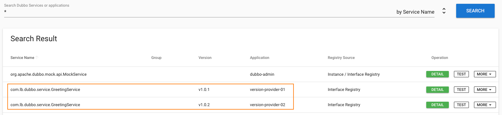

## 项目介绍
dubbo-version 是 Dubbo的一个高级特性:服务分版本,整体项目结构如下:

```text
.
├── README.md
├── dubbo-version-consumer// 消费者springboot服务
├── dubbo-version-interface// 公共接口
├── dubbo-version-provider// 提供者旧版本服务
├── dubbo-version-provider2// 提供者新版本服务
└── pom.xml

```
## 使用场景
当一个接口实现，出现不兼容升级时，可以用版本号过渡，版本号不同的服务相互间不引用。
(同时提供不同版本,  消费者通过选择不同版本进行调用)

## 特性说明
按照以下的步骤进行版本迁移:
1. 在低压力时间段，先升级一半提供者为新版本
2. 再将所有消费者升级为新版本
3. 然后将剩下的一半提供者升级为新版本

## 简要说明
1. 服务端提供多版本接口
2. 消费端按照版本引用,或配置为 `*` 不区分版本
    ```java  
    <dubbo:reference id="barService" interface="com.foo.BarService" version="*" />
   ```
